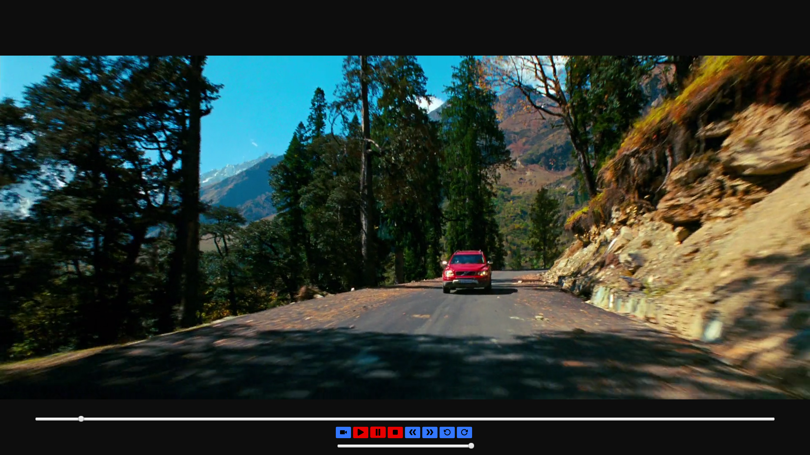

# neo-media-player

**Description** : Media Player using JavaFX

**Requisite** : Make sure you have WinRAR installed in your System

**For Windows OS** :

1. Extract all 3 parts of the setup inside the **setup** directory

2. Run **setup.exe** to install NeoMediaPlayer in your System.

3. **Double click** to enter **Theater Mode**

4. **Press Esc** to exit **Theater Mode**

**Supported Formats** : MP3/MP4/WAV/AIFF/FLV/AVC

**Unsupported Formats** : MKV

**Sample Screenshot** :

